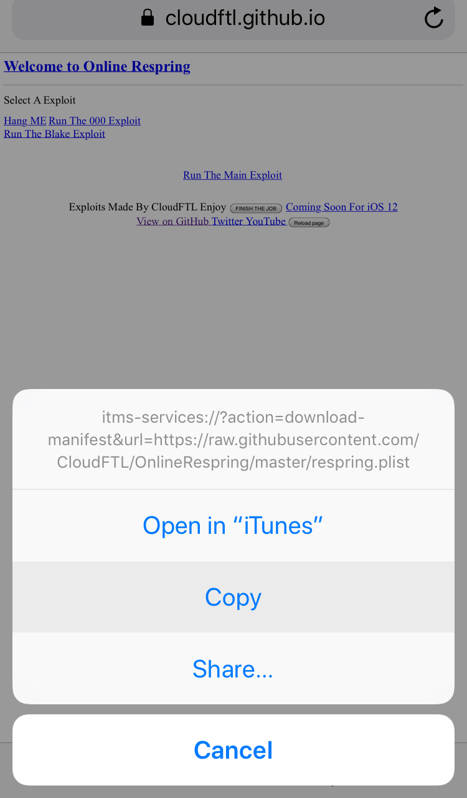
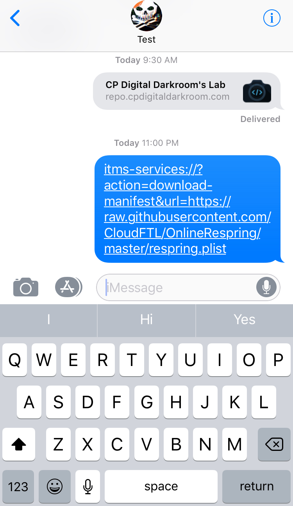

# So What Is The Purpose of OnlineRespring 
OnlineRespring is a website designed to respring iphones no matter what version the user is on (except ios 12)
Or you can use online respring as a way to piss off your friends just by sending them the link to one of the exploits
This site can be used on slow wifi as well as slow lte data because it's just a html page

# How To Prank Your Friends 

Go To http://cloudftl.github.io/OnlineRespring  
Press and hold on a exploit then click copy

once you have copied the exploit you wanna send paste the link in a imessage chat
then wait for your victim to click it ;)

